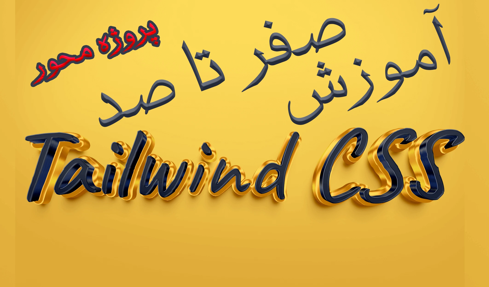

# 🎓 دوره‌های آموزشی من

## 🚀 درباره دوره‌ها

اینجا میتونید لیست دوره‌های آموزشی که من تدریس کردم رو ببینید. هر دوره با تکنولوژی‌های مختلف همراه هست!

## 📚 لیست دوره‌ها

### ⭐ Materialize CSS

**توضیحات:** دوره آموزشی متریالایز سی اس اس که در پلتفرم فرادرس قرار داره دارای دو دوره آموزشی بوده، یگ آموزش رایگان نیم ساعتی و مقدماتی و دیگری دوره کامل به همراه پروژه فروشگاهی-شرکتی.
همینطور برای این فریمورک جذاب یک دوره کامل به همراه پروژه در یوتیوب قرار دادم که خوشحال میشم ببینید.

**لینک دوره:** [مشاهده دوره رایگان](https://faradars.org/courses/materialize-css-fvj308)

**لینک دوره:** [مشاهده دوره یوتیوب](https://www.youtube.com/watch?v=2ByCZky5JyA)

**لینک دوره:** [مشاهده دوره اصلی](https://faradars.org/courses/website-design-using-materialize-css-fvj311)

---

### ⭐ Tailwind CSS

**توضیحات:** این دوره هنوز به طور کامل منتظر نشده و به محض منتشر شدن لینک رو آپدیت می کنم. این دوره آموزش کامل فریمورک محبوب تیولند سی اس اس می باشد به همراه پروژه نهایی جذاب و کلی چیز های جذاب.

**لینک دوره:** [مشاهده دوره اصلی](https://maktabkhooneh.org/course-preview/%d8%a2%d9%85%d9%88%d8%b2%d8%b4-tailwindcss-%d9%85%d8%a8%d8%aa%d8%af%db%8c-%d9%be%db%8c%d8%b4%d8%b1%d9%81%d8%aa%d9%87-%d9%be%d8%b1%d9%88%da%98%d9%87-%d9%85%d8%ad%d9%88%d8%b1-mk5867/?v=1#chapter)

---

## 📞 ارتباط با من

شما دوستان گل می تونید از طریق ایمیل: [aasoft.ir@gmail.com](mailto:aasoft.ir@gmail.com) و یا آیدی تلگرام: [aasoft_2003](https://t.me/aasoft_2003) با من درارتباط باشید 💖.

